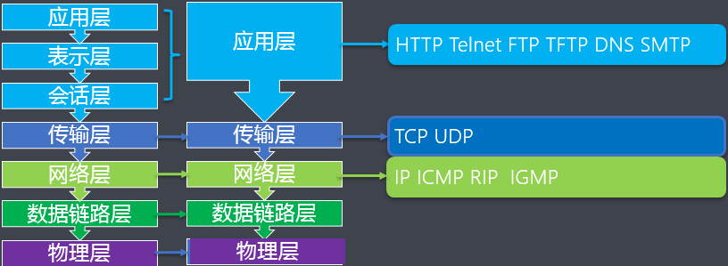
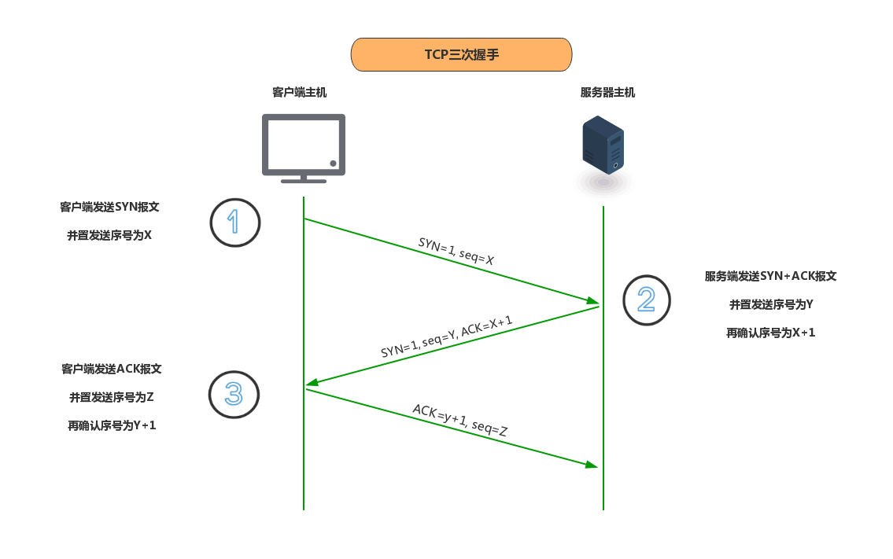

# lg_stage01_module04
阶段1模块4：Java 核心类库（下）

## 网络编程

## 1. 网络编程的常识

### 1.1 七层网络模型

### 1.2. 相关的协议

#### 1.2.1 协议的概念

* 计算机在网络中实现通信就必须有一些约定或规则，叫做通信协议，通信协议可以对速率、传输代码、代码结构、传输控制步骤、
出错控制等制定统一的标准。

#### 1.2.2 TCP协议

#### 1.2.3. ip地址

* ip地址是网络中的唯一标识

#### 1.2.4. 端口号

### 1.3. 基于TCP协议的编程模型

* 传输控制协议（Transmission Control Protocol）面向连接的协议

三次我握手

#### 1.2.3 UDP协议

* 用户数据报协议（User Dia）非面向连接的协议

## 2. 基于TCP协议的编程模型

### 2.1 C/S架构

## 3. 基于UDP协议的编程模型

## 4.URL类